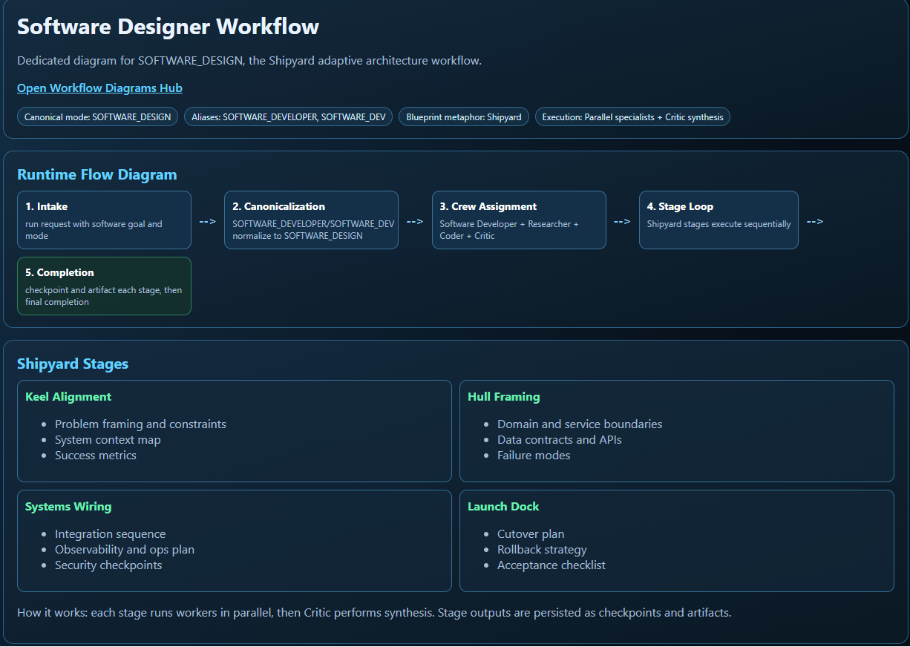
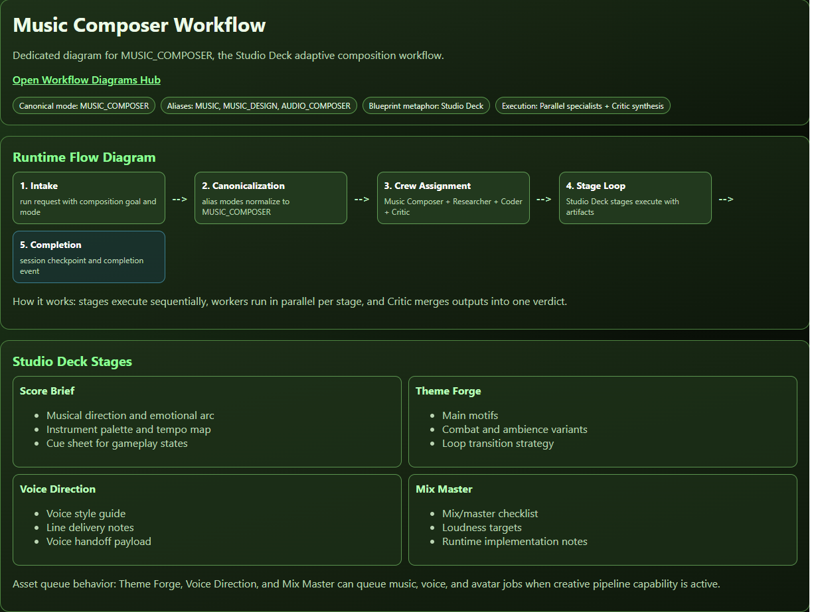
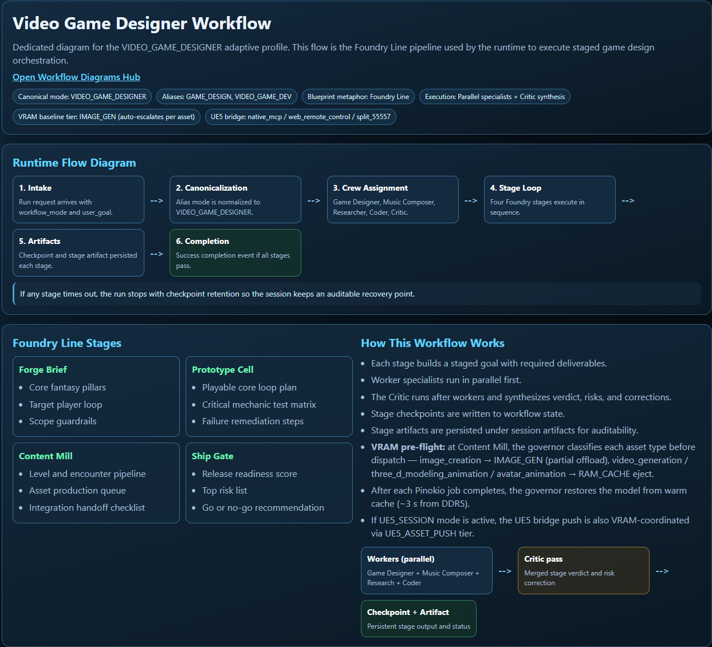

# 🌌 Odysseus: Multi-Agentic Command & Control

**[ STATUS: OPERATIONAL | VERSION: 0.0.92 ]**

> **Odysseus is a proprietary, high-performance orchestration framework designed for autonomous, multimodal task execution. It bridges the gap between Large Language Models and physical/digital interaction through a sophisticated "Sensory-to-Action" (S2A) pipeline.**

---

## 🚀 The Architecture: A Triple-Layer Command Model

Odysseus operates through a decoupled, three-tier architecture designed for stability, observability, and high-fidelity interaction.

### 🧠 **1. The Intelligence Layer (Cognitive Engine)**
A stateful, high-concurrency orchestration engine. Unlike standard chatbots, Odysseus utilizes **Semantic Memory (RAG)** to achieve true long-term cognitive persistence.

### 👁️ **2. The Sensory Layer (Perception & Interaction)**
A multimodal perception stack that converts visual, DOM, and coordinate data into actionable intelligence. Includes a custom **Browser Orchestrator** for high-fidelity, human-parity web interaction.

### 🎮 **3. The Interface Layer (Mission Control)**
A high-performance, low-latency dashboard providing real-time telemetry, "Thought Stream" monitoring, and resource load visualization.

---

## 🔄 Operational Workflow Profiles

Odysseus adapts its resource allocation and workflow complexity based on the mission profile. 

### 🖼️ Visual Workflow Overviews
*Interactive and static views of our core operational logic:*

| **Software Designer** | **Music Composer** | **Game Designer** |
| :---: | :---: | :---: |
|  |  |  |
| *[View Interactive Shipyard $\rightarrow$](workflow_diagram.html)* | *[View Interactive Studio $\rightarrow$](music_composer_workflow_diagram.html)* | *[View Interactive Foundry $\rightarrow$](video_game_designer_workflow_diagram.html)* |

**[View All Adaptive Workflow Diagrams (Interactive) $\rightarrow$](workflow_diagrams_index.html)**

---

## 🛡️ Security & Access Protocol

**Odysseus is a proprietary, closed-loop ecosystem. Access is strictly controlled.**

 - **Public Access:** High-level architecture, workflow capabilities, and telemetry previews.
 - **Authorized Access:** Full source code, `MASTER_CHIEF` operational manuals, and administrative credentials are restricted to authenticated operators.

---

*© 2026 Odysseus Framework. All Rights Reserved.*
